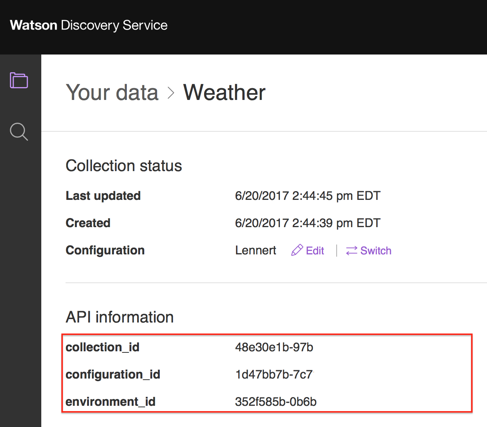
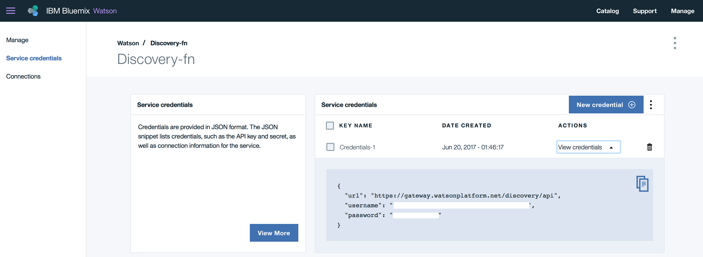
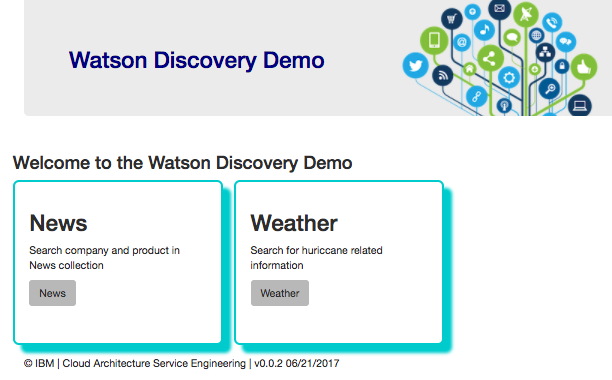

# Watson Discovery Broker Service
*This project is part of the 'IBM Cognitive Reference Architecture' suite, available at https://github.com/ibm-cloud-architecture/refarch-cognitive*

This project implements a micro service deployable as a containerized application on IBM Bluemix to facade Watson Discovery service as there is always needs to support data mapping between the raw json response from Watson and to expose special user interface for the returned data. The value of this broker code is to support resiliency, service management, logging, and other integration. Therefore this broker server exposes REST api that user interface born on cloud or IBM BPM coaches can consume. It uses a Node.js backend to host the static content and implement the BFF (Backend for Frontend) pattern.

The concept of broker is presented in the IBM Cognitive Reference Architecture for Engagement and Discovery as illustrated in the figure below, as the 'Discovery Application' icon.  


## Current Version
This version is under development. Here is an overview of the project's features:

* Angular 2 Single Page Application
* Node.js/express.js based Backend For Frontend application to access APIs
* Distributed as Docker container and deployed to Kubernetes cluster on Bluemix
* Integrate Watson Developer API for Discovery

You can fork it for your own purpose and develop your own solution by reusing the code. If you want to contribute please submit a pull request on this repository. The contribution guidelines are   [here](https://github.com/ibm-cloud-architecture/refarch-cognitive#contribute)

## Table of content
* [What you will learn](https://github.com/ibm-cloud-architecture/refarch-cognitive-discovery-broker#what-you-will-learn-from-this-project)
* [Run and test locally](https://github.com/ibm-cloud-architecture/refarch-cognitive-discovery-broker#run-and-test-locally)  
* [Demonstration script](doc/demo-script.md)
* [Deploy](https://github.com/ibm-cloud-architecture/refarch-cognitive-discovery-broker#deploy-to-bluemix)
* [Deep Dive Tutorial for Watson Discovery](https://github.com/ibm-cloud-architecture/refarch-cognitive-discovery-broker/blob/master/doc/tutorial/wds-lab.md)
* [Code Explanation](doc/broker-code.md)
* [FAQ](doc/faq.md)

## What you will learn from this project
* Watson Discovery creation and development activities
* Watson Discovery API and how to integrate within a web application or a micro service
* How to add resiliency to your broker
* How to present the Discovery results in Angular 2 SPA.

## Run and test locally
You need to have your local development environment properly configured with all the tools installed, for example, Docker and Kubernetes command line tool. If needed we package a shell to download all the CLI needed see [this section](https://github.com/ibm-cloud-architecture/refarch-cognitive#build-and-run-locally-each-application)

### Pre requisites
To be able to run this Watson Discovery broker you need your own instance of a bluemix Watson Discovery Service. See the [tutorial](https://github.com/ibm-cloud-architecture/refarch-cognitive-discovery-broker/blob/master/doc/tutorial/wds-lab.md) for how to do so.

Once you have created this service rename the server/routes/env-templ.json to env.json and modify the userid, password, environment_id and collection_id to point to your own service.

Be sure to have setup Cloud Foundry Command line interface and bluemix CLI.

### Skill set
To understand how to build a **Discovery** collection the following [tutorial](doc/tutorial/wds-lab.md) will help to go step by step with weather related corpus. The audience of this tutorial is for beginner and developer and support different level of knowledge from simple to deeper dive.


### Clone the repository to your local machine
To clone this repository to your local machine, please use 'git' or a graphical tool like 'sourcetree'.
Example for git:

Go to a directory where you want the source to be created in, clone the repo:
```
mkdir ~/stsa/WatsonDiscovery
cd ~/stsa/WatsonDiscovery
git clone https://github.com/ibm-cloud-architecture/refarch-cognitive-discovery-broker.git
cd refarch-cognitive-discovery-broker
```


### Build
Be sure to run the npm installation to get the dependent javascript modules
```
# To update npm tool globally
sudo npm i -g npm
# install the following package globally too
sudo npm i -g node
sudo npm i -g node-gyp@3.6.2
# Then install the package from package json
npm install
```
Run `ng build` to build the client Angular 2 project. The build artifacts will be stored in the `dist/` directory. Use the `-prod` flag for a production build.

If you want to work on the user interface only, you can use the command (this is for UI work only and will not successfully connect to the Bluemix instance - to do that perform the next steps)
```
ng serve
```

### Test Locally with the BFF server
Change the `env-temp.json` file in `./server/routes/env-templ.json` to match your environment, name it `env.json`

The environment information can be found in Collection screen:


And from the Service Credentials screen in the Bluemix Dashboard


Add the username, password, environment_id, collection_id and configuration_id parameters where needed.

```
{
    "discovery": {
        "username": "",
        "password": "",
        "version_date": "2016-12-01",
        "version":"v1",
        "environment_id": "",
        "collection_id": ""
    },
    "weatherCollection" : {
      "username": "",
      "password": "",
      "version_date": "2016-12-01",
      "version":"v1",
      "environment_id": "",
      "collection_id": "",
      "configuration_id":""
    }
}
```
And save the file as env.json

Use the following command to start the local server:
```
npm run dev
```

If you run into any npm dependency issues, or missing modules, add them using the command
```
npm install <missing module>
```

And rerun the command to start the server
```
npm run dev
```

Then use a web browser to http://localhost:6010 which should display a home page with different choices. (The port number may be different, consult the server trace)  
  

See the demonstration script [here](doc/demo-script.md)

## Deploy to Bluemix
We have two choices, using Cloud Foundry or using Docker container to be deployed on Kubernetes Cluster. We recommend the second choice.

### Using Cloud Foundry
We will not go over the detail on how to create a cloud foundry application in bluemix as it is covered a lot within other Bluemix blogs, but you need to do the following steps

* Using cloud foundry command line interface login to your region, organization and space.
```
cf login
```
* Ensure the file Manifest.yml reflects the name of the host and URL you have configured in Bluemix nodejs cloud application:
```
applications:
- path: .
  memory: 256M
  instances: 1
  domain: mybluemix.net
  name: refarch-wds-broker
  host: refarch-wds-broker
  disk_quota: 1024M
```
* perform a push with the name of the application, for example:
```
cf push refarch-cognitive-discovery-broker
```
* Validate the deployment on your Bluemix dashboard and using the defined URL.

### Deploy to Kubernetes cluster
As of June 2017 the **Cyan compute** uses Bluemix Kubernetes Service and containerized application, like this Discovery broker microservice, so it can be deployed to public and private cloud platform. You can read detail in [this note](doc/wds-broker-kube.md)

## Code explanation
To get detail on how the code is working and organized see the node [here](doc/broker-code.md)

## Frequent Asked Questions
They are in a separate document [here](doc/faq.md)
