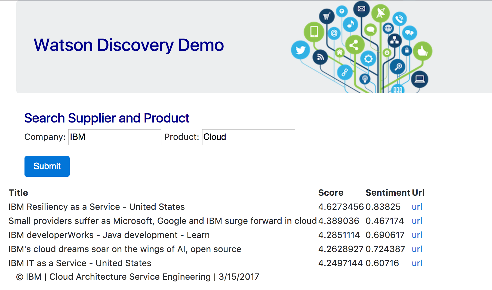
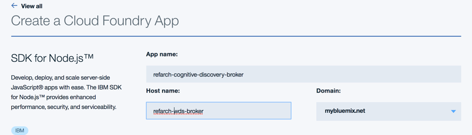

# Watson Discovery Broker Service

This project implements a micro service deployable as a Cloud Foundry application on bluemix to facade Watson Discovery service as there is always needs to support data mapping between the raw json response from Watson and to expose special user interface for the returned data. The value also of this broker code is to support resiliency, service management, logging. Therefore this broker exposes REST api that user interface born on cloud or IBM BPM coaches can consume.
The concept of broker is presented in the IBM Cognitive Reference Architecture for Engagement and Discovery as illustrated in the figure below, as the 'Discovery Application' icon.  


# Current Version
This version is under development. You can fork it for your own purpose and develop your own solution by reusing the code. If you want to contribute please submit a pull request on this repository. The contribution guidelines are [here](https://github.com/ibm-cloud-architecture/refarch-cognitive#contribute)

# Pre requisites
To be able to run this Watson Discovery broker you need your own instance of a bluemix Watson Discovery Service. Once you have created this service rename the server/routes/env-templ.json to env.json and modify the userid, password, environment_id and collection_id to point to your own service.

Be sure to have setup Cloud Foundry Command line interface and bluemix CLI.

# Skill set
To understand how to build a **Discovery** collection the following [tutorial](doc/tutorial/wds-lab.md) will help to go step by step with weather related corpus. The audience of this tutorial is for beginner and advanced developer

# REST APIs exposed
The broker code offers two entry points and mapping user interface:
| Description | API  | User interface |
| ----------- | ---- | -------------- |
|  | /api/company/production | Query news |
|  | /api/weather | Weather |

---
# Code explanation
The client folder includes the angular 2 user interface, the user interface is used for demonstration purpose. As micro service the more important part is on the server side.

This server code use expressjs and its middleware mechanism to map URL to function. The `server.js` declare the component to use and start a web server based on nodejs.

The interesting parts are explained in the snippet below:
```
// As the server exposes REST api to be consumed by the UI we delegate to a separate api module
const api = require('./routes/api');

// Point static path to dist where angular 2 compiled js reside
app.use(express.static(path.join(__dirname, '../dist')));

// Set our api routes
app.use('/api', api);

// Catch all other routes and return the index file as single page application
app.get('*', (req, res) => {
  res.sendFile(path.join(__dirname, '../dist/index.html'));
});
```

When the URL is based as /api/discovery the module in charge is routes/features/discovery.js. This code uses the watson cloud develop api for nodejs.

# Build
Be sure to run the npm installation to get the dependent javascript modules
```
npm install
```
Run `ng build` to build the client Angular 2 project. The build artifacts will be stored in the `dist/` directory. Use the `-prod` flag for a production build.
If you want to work on the user interface only you can use the command
```
ng serve
```

# Test Locally
Use the command
```
npm run dev
```
Then use a web browser to http://localhost:6010 which should display a simple form to enter the company name and product name to let Watson search for those information inside the News curated data.


# Deploy to bluemix
We will not go over the detail on how to create a cloud foundry application in bluemix but you need to do the following steps
* create a nodejs SDK cloud foundry application, be sure to use a name not in conflict with existing application under the mybluemix.net domain.

* Using cloud foundry command line interface login to your region, organization and space.
```
cf login
```
* Ensure the file Manifest.yml reflects the name of the host and URL you have configured in Bluemix nodejs cloud application:
```
applications:
- path: .
  memory: 256M
  instances: 1
  domain: mybluemix.net
  name: refarch-wds-broker
  host: refarch-wds-broker
  disk_quota: 1024M
```
* perform a push with the name of the application, for example:
```
cf push refarch-cognitive-discovery-broker
```
* Validate the deployment on your bluemix dashboard and using the defined URL.
