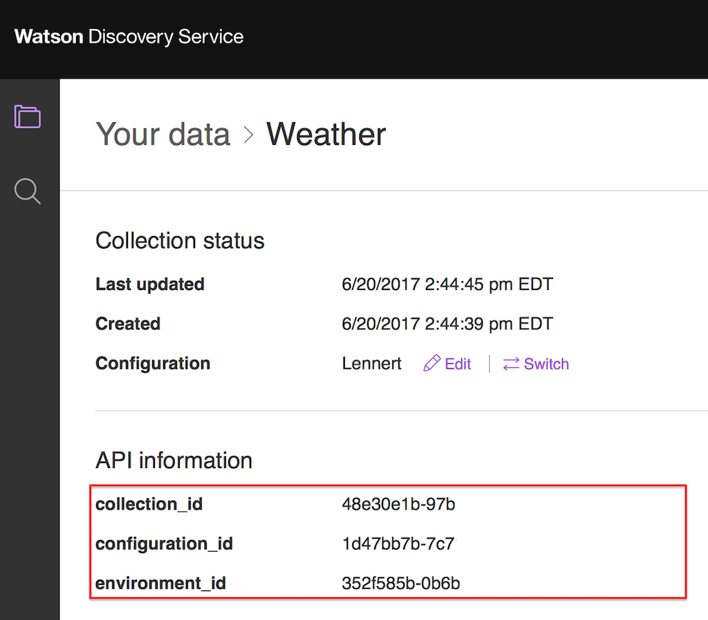
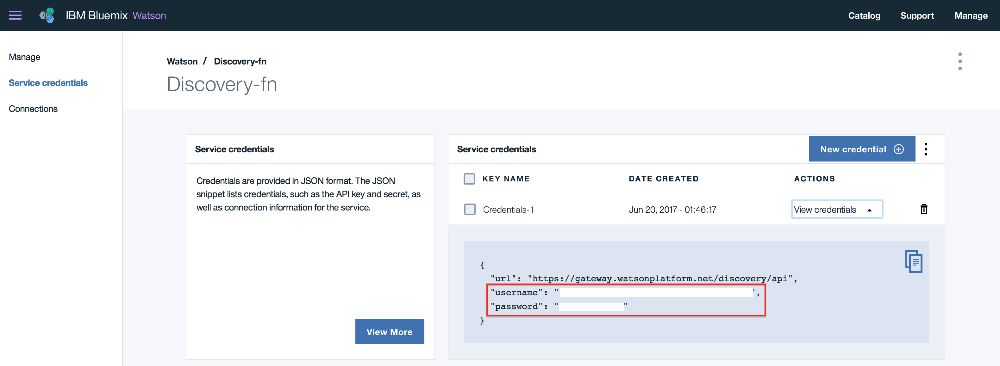

# Watson Discovery Broker Service
*This project is part of the 'IBM Cognitive Reference Architecture', cyan compute validation, available at https://github.com/ibm-cloud-architecture/refarch-cognitive*  
Updated 05/24/2018: Angular 6 - new Watson API

## Table of contents
* [Introduction](#introduction)
* [What you will learn](#what-you-will-learn-from-this-project)
* [Run and test locally](#run-and-test-locally)  
* [Demonstration script](docs/demo-script.md)
* [Deploy](#deploy)
* [Deep Dive Tutorial for Watson Discovery](docs/tutorial/wds-lab.md)
* [Code Explanation](docs/broker-code.md)
* [FAQ](docs/faq.md)

## Introduction

This project implements a microservice deployable as a containerized application on IBM Cloud or IBM Cloud Private to facade Watson Discovery service to address integration requirements. There are always requirements for data mapping, expose special user interface or to do service orchestration. The value of this broker code is to support resiliency, service management, logging, and other integrations.
Therefore this broker server exposes REST api that user interface born on cloud or any application  (like IBM BPM coaches) can consume. It uses a Node.js express.js backend to host the static content and implements the BFF (Backend for Frontend) pattern.

The concept of broker is presented in the IBM Cognitive Reference Architecture for Engagement and Discovery as illustrated in the figure below, as the 'Discovery Application' icon.  


### Current Version
The current version (May 2018) has the following features:

* Angular 6 Single Page Application user interface to present Watson News collection query and to support the [Discovery training](https://www.ibm.com/cloud/garage/architectures/cognitiveDiscoveryDomain/create-query-data-collection-watson-discovery) we developed in 2017 for Weather collection.
* Backend For Frontend application to serve the angular app and to offer a set of APIs for the search within Discovery collections.
* Distributed as Docker container and deployed to Kubernetes cluster on IBM Cloud container or IBM Cloud Private
* Integrate Watson Developer API for Discovery

You can fork it for your own purpose and develop your own solution by reusing the code. If you want to contribute please submit a pull request on this repository. The contribution guidelines are   [here](https://github.com/ibm-cloud-architecture/refarch-cognitive#contribute)


## What you will learn from this project
* Watson Discovery creation and development activities
* Watson Discovery API and how to integrate within a web application or a micro service
* How to add resiliency to your broker
* How to present the Discovery results in Angular 2 SPA.

## Run and test locally

You need to have your local development environment properly configured with all the tools installed, for example, Angular CLI, node, Docker and Kubernetes command line tool. If needed we packaged a shell to download all the CLI needed see [this section](https://github.com/ibm-cloud-architecture/refarch-cognitive#build-and-run-locally-each-application)

### Skill set
To understand how to build a **Discovery** collection the following [tutorial](./docs/tutorial/wds-lab.md) will help to go step by step with weather related corpus. The audience of this tutorial is for beginner and developer as it supports different knowledge level from simple to deeper dive.

### If you do not have git...
Install git on Mac by installing the Command Line Tools for xCode.

To do this, open a terminal and execute the following command.
```
xcode-select --install
```

On Windows:
Download and install the package from https://git-for-windows.github.io and install it.

### Create a Watson Discovery Service on IBM Cloud
To be able to run this Watson Discovery broker you need your own instance of a IBM Cloud Watson Discovery Service. See the [tutorial](./docs/tutorial/wds-lab.md) for how to do so.

Once you have created this service rename the server/routes/env-templ.json to env.json and modify the userid, password, environment_id and collection_id to point to your own service.

Be sure to have setup Cloud Foundry Command line interface and IBM Cloud CLI.


### Clone the repository to your local machine
To clone this repository to your local machine, please use 'git' or a graphical tool like 'sourcetree'.
Example for git:

Go to a directory where you want the source to be created in, clone the repo:
```
mkdir ~/stsa/WatsonDiscovery
cd ~/stsa/WatsonDiscovery
git clone https://github.com/ibm-cloud-architecture/refarch-cognitive-discovery-broker.git
cd refarch-cognitive-discovery-broker
```


### Build
Be sure to run the npm installation to get the dependent javascript modules
```
# To update npm tool globally
sudo npm i -g npm
# install the following package globally too
sudo npm i -g node
sudo npm i -g node-gyp@3.6.2
sudo npm i -g @angular/cli@latest

# Then install the package from package json
npm install
```
Run `ng build` to build the client Angular 2 project. The build artifacts will be stored in the `dist/` directory. Use the `-prod` flag for a production build.

If you want to work on the user interface only, you can use the command below (this is for UI work only and will not successfully connect to the IBM Cloud instance)
```
ng serve
```
So when we need to have the real server running perform the next step.

### Test Locally with the BFF server
Be sure to have setup the content of the file `config.json` file under the server/routes/config folder. To do so rename the `config-tmpl.json` file in `./server/routes/config` to `config.json` and open it with a text editor.

The environment information can be found in Collection screen in Watson Discovery Service:


And from the Service Credentials screen in your IBM Cloud Dashboard


Add the username, password, environment_id, collection_id and configuration_id parameters where needed. DO NOT CHANGE the attributes' name as they are used to load the data in the broker.

```
{
    "discovery": {
        "username": "",
        "password": "",
        "version_date": "2018-03-05",
        "version":"v1",
        "environment_id": "",
        "collection_id": ""
    },
    "weatherCollection" : {
      "username": "",
      "password": "",
      "version_date": "2018-03-05",
      "version":"v1",
      "environment_id": "",
      "collection_id": "",
      "configuration_id":""
    }
}
```

To start the local BFF server, use the following command:
```
npm start
```

If you run into any npm dependency issues, or missing modules, add them using the command. Normally the package.json is accurate, and validated as of May 2018.
```
npm install <missing module>
```

And rerun the command to start the server
```
npm start
```

Finally use a web browser to http://localhost:6010 which should display a home page with different choices. (The port number may be different, consult the server trace)  
  

See the demonstration script for information about running the demo [here](docs/demo-script.md)

# Deploy
We have two choices, using Cloud Foundry or using Docker container to be deployed on Kubernetes Cluster. We recommend the second choice.

## Using Cloud Foundry
We will not go over the detail on how to create a cloud foundry application in IBM Cloud as it is covered a lot within other IBM Cloud blogs, but you need to do the following steps

* Using cloud foundry command line interface login to your region, organization and space.
```
cf login
```
* Ensure the file Manifest.yml reflects the name of the host and URL you have configured in IBM Cloud nodejs cloud application:
```
applications:
- path: .
  memory: 256M
  instances: 1
  domain: mybluemix.net
  name: refarch-wds-broker
  host: refarch-wds-broker
  disk_quota: 1024M
```
* perform a push with the name of the application, for example:
```
cf push refarch-cognitive-discovery-broker
```
* Validate the deployment on your IBM Cloud dashboard and using the defined URL.

## Deploy to Kubernetes cluster
As of June 2017 the **Cyan compute** uses IBM Cloud Kubernetes Service and containerized application, like this Discovery broker microservice, so it can be deployed to public and private cloud platform. You can read detail in [this note](docs/wds-broker-kube.md)

## Code explanation
To get detail on how the code is working and organized see the node [here](docs/broker-code.md)

## Frequent Asked Questions
They are in a separate document [here](docs/faq.md)
