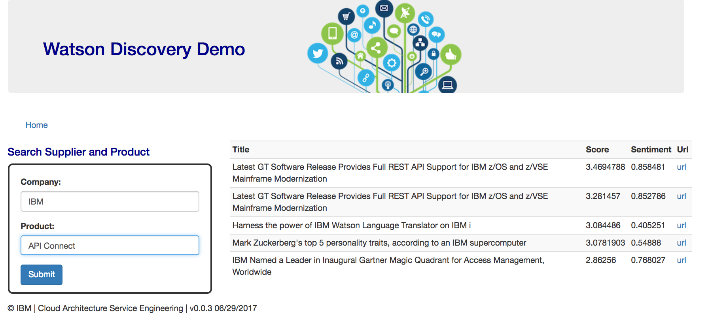

# Watson Discovery Broker User Interface Demonstration

We are addressing two use cases:
* [Querying the Watson News collection]() to search for information about a company and a product
* [Searching information about Hurricane]() in a private created collection. As part of the [tutorial](tutorial/wds-lab.md)

## Supplier query
This use case is linked to the Supplier on boarding process described in the Architecture Center [here](https://www.ibm.com/devops/method/content/architecture/cognitiveDiscoveryDomain2/1_2). Supplier due diligence business process involves assessing supplier risk and reputation.
So the approach is very simple.
* First from the home page:  

select the News link to reach the following page:  

  

Enter a company name and a product. IBM and API connect, then you should get the list of the top 5 most accurate responses with a score and sentiment   

The News feature presents a simple form to enter the company name and product name to let Watson search for those information inside the News curated data.   
   
The Weather one is presenting a form to select a persona, predefined query or enter free text query, then returns the results.
