# Building a Discovery Service for Weather data

IBM [Watson Discovery Service](https://www.ibm.com/watson/developercloud/discovery.html) (WDS) is a Watson service which provides the developers the ability to rapidly add a cognitive, search and content analytics engine to application to identify patterns, trends and insights from **unstructured data**, that drive better decision making.
The purpose of this section is to show how to set up and configure Watson Discovery Service and how to inject documents about hurricane and weather management. Watson Discovery Service is only available on Bluemix.
Once created WDS instance allows you to ingest (convert, enrich, clean, normalize), store and query data to extract actionable insights.

You can create and configure a Watson Discovery service instance by using either the Discovery Tooling or the Discovery API. In the beginning of this tutorial we are using the Discovery Tooling to prepare the Discovery content and perform query, as most users will do, and then we go over the API for doing training, and API to access the service from a Web Application or a microservice.

The standard development path for using Watson Discovery is presented in the following diagram:


To summarize this diagram: to be able to do search / query we need content, which needs to be injected and persisted in *collection*. We are addressing these steps in this lab.

The labs files used for creating collection of documents are under the wds-docs folder.

The current working application to demonstrate the end product of this tutorial is here: [WDS Broker on Bluemix](https://refarch-wds-broker.mybluemix.net/)  

# Table of content
At the end of this tutorial you will be able to create a Discovery service and to prepare private document collection so a business analysts can use a custom bluemix web application to enter queries related to a specific subject, like weather, to find interesting relation, concepts, and drive better decisions. As a developer you will have The sections are:

* [Create a Watson Discovery Instance](https://github.com/ibm-cloud-architecture/refarch-cognitive-discovery-broker/blob/master/docs/tutorial/wds-lab.md#task-1---create-a-watson-discovery-instance)
* [Prepare Data / Documents](https://github.com/ibm-cloud-architecture/refarch-cognitive-discovery-broker/blob/master/docs/tutorial/wds-lab.md#task-2---prepare-data--documents)
* [Execute query](https://github.com/ibm-cloud-architecture/refarch-cognitive-discovery-broker/blob/master/docs/tutorial/wds-lab.md#task-3---doing-first-query)
* [Work on more content](https://github.com/ibm-cloud-architecture/refarch-cognitive-discovery-broker/blob/master/docs/tutorial/wds-lab.md#task-4---upload-more-content)
* [Understanding Collection Configuration](https://github.com/ibm-cloud-architecture/refarch-cognitive-discovery-broker/blob/master/docs/tutorial/wds-lab.md#task-5---understanding-configuration)
* [Preparing document](https://github.com/ibm-cloud-architecture/refarch-cognitive-discovery-broker/blob/master/docs/tutorial/wds-lab.md#task-6---preparing-documents)
* [Perform Advanced Queries](https://github.com/ibm-cloud-architecture/refarch-cognitive-discovery-broker/blob/master/docs/tutorial/wds-lab.md#task-7--performing-advanced-queries)
* []
* [Explore Discovery API](https://github.com/ibm-cloud-architecture/refarch-cognitive-discovery-broker/blob/master/docs/tutorial/wds-lab.md#task-8---explore-watson-discovery-api)
* [Training Discovery](https://github.com/ibm-cloud-architecture/refarch-cognitive-discovery-broker/blob/master/docs/tutorial/wds-lab.md#task-9---training-discovery)
* [Review integration code](https://github.com/ibm-cloud-architecture/refarch-cognitive-discovery-broker/blob/master/docs/tutorial/wds-lab.md#task-10---broker-code-explanation)
* [Enhance results with Watson Knowledge Studio](https://github.com/ibm-cloud-architecture/refarch-cognitive-discovery-broker/blob/master/docs/tutorial/wds-lab.md#task-11---enhance-with-watson-studio)


# Tutorial Structure
We organize this tutorial in layers to address different skill set.  

* **Level 0** - Data ingestion, Discovery tooling, and simple querying, seeing the output in the browser
* **Level 1** - Collection configuration, enrichment, filters, content / data preparation
* **Level 2** - Advanced search, API based access and refinement of results, Watson API explorer, CURL or nodejs script to use API
* **Level 3** - Advanced topics. Explore the Discovery broker,  connecting discovery and conversation, using Speech To Text, Watson knowledge Studio.

For beginner you need to do this tutorial for level 0 and 1 which map to tasks from 1 to 6, so you will be able to understand how Discovery works.

For developer, try to do all the 4 levels to get a deep understanding of the service.

# Prerequisites
* If you do not have one already, create a Bluemix account: Go to Bluemix (https://console.ng.bluemix.net) and use the **Create a Bluemix account** if you do not have one.

For developer the following are assumed
* Having a Bluemix account, how to search the service catalog and how to create services
* Using Bluemix command line interface
* Programming in nodejs & expressjs
* Having a github account and know how to use git commands

# Clone the repository to your local machine
The Weather documents used in this labs are in the project under the wds-docs, so you need to get a local copy of this git repository on your local computer by doing a `git clone` or download a zip.

### If you do not have git...
Install git on Mac by installing the Command Line Tools for xCode.

To do this, open a terminal and execute the following command.
```
xcode-select --install
```

On Windows:
Download and install the package from https://git-for-windows.github.io and install it.

### Clone the repository
To clone this repository to your local machine, please use 'git' or a graphical tool like 'sourcetree'.
Example for git:

Go to a directory where you want the source to be created in, clone the repo:
```
mkdir ~/stsa/WatsonDiscovery
cd ~/stsa/WatsonDiscovery
git clone https://github.com/ibm-cloud-architecture/refarch-cognitive-discovery-broker.git
cd refarch-cognitive-discovery-broker
```

# Level 0 - Configure Discovery Service
The Watson Discovery Service or WDS is listed under the Watson section of the Bluemix catalog. Before you start you need to create a service instance.

## Task 1 - Create a Watson Discovery Instance
This will allow you to create an environment where you can create one or more data collections into which you can add your own content and associate with a configuration.
1- Select “Catalog” from the top right corner to view the service catalog.  


Go to [Watson Discovery Service on Bluemix] (https://console.bluemix.net/catalog/services/discovery/?cm_mc_uid=35796192015914973653529&cm_mc_sid_50200000=1497371009&cm_mc_sid_52640000=1497371009&env_id=ibm:yp:us-south)  

2- From the Bluemix Catalog; first select “Watson” then select **Discovery**  

  

3- On the Discovery page; Select “Create” and wait for the instance to be created.  


4- Create collection:  

The Discovery service includes a complete set of online tools **the Discovery Tooling** to help you quickly setup an instance of the service and populate it with data.  


The Discovery service Tooling has been designed to save time by eliminating the need to use APIs to configure and populate your service. This lets application developers concentrate on creating high value ways for end users to experience the Discovery Service. In the Discovery service, the content that you upload is stored in a **collection** that is part of an **environment**. You must create the environment and collection before you can upload your content. So use the **Create a data collection** and name your new collection as **Weather**   

  

Each collection you create is a logical division of your data in the environment. Each collection will be queried independently when you get to the point of delivering results.

## Task 2 - Prepare Data / Documents
As illustrated in the development path diagram above, the data acquisition work is very important and may take some time depending of the document quality. Let illustrate that: Our use case is related to hurricane knowledge, so searching for source of knowledge we can use private data owned by our company or public content.

Let start simple going to [https://www.ready.gov/hurricanes](https://www.ready.gov/hurricanes) URL with a web browser we can see interesting source of knowledge about being ready for hurricane. The HTML page also contents noisy data, like menu links, images, ads... so we may need to prepare the document, by removing unwanted content and how to prepare passage extraction: we will address that in later section [Preparing document](https://github.com/ibm-cloud-architecture/refarch-cognitive-discovery-broker/blob/master/docs/tutorial/wds-lab.md#preparing-document).  First, from the web browser, we can *print* the page as pdf file. This page was saved as pdf document, for you to use, as wds-docs/L0/Hurricanes_Ready.pdf. Next step is to upload it to the collection just created: Using the Discovery Tooling, select your *weather* collection then from the main page use the **Add data to this collection** drag and drop panel, upload the Hurricanes_Ready.pdf file.  


You should get a message about successful upload. So let do a simple query.

## Task 3 - Doing first query
As soon as one document is uploaded you can start doing some query in plain language. Select your collection from the Discovery Tooling main page, then using the *Query this collection* button on the top left, you should reach the *My data insights* page:


**Top keywords** displays the most important topics in your documents, discovered by the Keyword Extraction enrichment.

On the left side it is possible to filter out the content based on enrichment done by the document ingestion step. See

The following diagram illustrates a document section we want to search for:   
Using the *Build your own query*, you reach the *Ask a question in plain language* and enter the query: **What to do when hurricane is 6 hours from arriving?**   
When creating a query, you can be as vague or as specific as you want. The more specific the query, the more targeted the results.

The following diagram illustrates the JSON responses returned


We can see the passage text does not perfectly match the expected section. But very close, so the default conversion works. Passages are short, relevant excerpts extracted from the full documents returned by your query. These targeted passages are extracted from the text fields of the documents in your collection.

The very interesting content is in the JSON results which lists the generated semantic analysis like *Taxonomy, Keywords, Entities*


During the ingestion step all of your documents are converted to JSON before they are enriched and indexed. Microsoft Word and PDF documents are converted to HTML first, then JSON.

By default, Discovery will enrich (add cognitive metadata to) the text field of your ingested documents with semantic information collected by these six Watson functions: Entity Extraction, Keyword Extraction, Taxonomy Classification, Concept Tagging, Relation Extraction, and Sentiment Analysis.
Expand the JSON tags by clicking on the triangle icons before the tags to view all transformations on the right side panel.

## Task 4 - Upload more content
So far you have worked with one document, you need to upload more content to get better results and being able to do more complex queries.

Using the drag and drop capability in the Collection Main page: 
 the following documents from the **wds-docs/L0** folder:
* `Zhang_et_al-2009-Disasters.pdf`  a research paper about the major findings within the business development research
 field and the disaster research field, for evaluating business vulnerability to natural disasters.
* Deadliest World Tropical Cyclones * Typhoon & Hurricane - Pakistan Weather Forecast and Updates, Satellite Maps, Articles, Cyclones and Earthquake Updates
* GALVESTON.COM_ Hurricane Preparation Guide
* Hurricane preparedness - Wikipedia
* Hurricane Preparedness Tips - Office of Emergency Management
* Keep-a-hurricane-preparation-checklist-CNN
After that you should have 7 documents in the collection.

# Level 1 - Collection configuration
## Task 5 - Understanding configuration
Collections are associated with configuration. Configuration controls how the **Convert, Enrich, and Normalize** steps are performed during document ingestion.

From the main page of the **Weather** collection, use the Switch hyperlink to prepare for a new configuration


Then use the *Create new configuration* link, and finally in the next form enter a configuration name:


### Convert
The first step is the document conversion. Depending of the source type, you can specify the conversion rules:  


For *pdf, and Microsoft Word* the conversion rules are based on the font type and size to assess the heading type. This is the less efficient format as input because some document may use header 1 font size differently. The range font size should help to address this problem. But the preferred format for input document is html.

The HTML rules are applied to input HTML documents but also to *pdf and Word* converted documents. The default HTML rules should work for most case.

Finally for JSON, you can control the attributes you need to keep. For example the *html* view of the document may not be needed, so use the **Move, merge, copy or remove fields* choice as illustrated below:


### Enrich
The second configuration is related to **Enrich** step.

By default, Discovery will enrich (add cognitive metadata to) the **text** field of your ingested documents with semantic information collected by these six Watson functions - Entity Extraction, Keyword Extraction, Taxonomy Classification, Concept Tagging, Relation Extraction, and Sentiment Analysis.

For example, *Entity extraction* adds semantic knowledge to content to help understand the subject and context of the text that is being analyzed. In the example below, the term 'Hurricane' was classified as 'NaturalDisaster' with a 86% relevance.

```JSON
{
      "type": "NaturalDisaster",
      "relevance": 0.86074,
      "sentiment": {
        "type": "negative",
        "score": -0.551763,
        "mixed": false
      },
      "count": 13,
      "text": "Hurricane",
      "disambiguated": {
        "name": "Tropical cyclone",
        "dbpedia": "http://dbpedia.org/resource/Tropical_cyclone",
        "freebase": "http://rdf.freebase.com/ns/m.07r2x",
        "yago": "http://yago-knowledge.org/resource/Tropical_cyclone"
      }
    },
```

Discovery automatically identifies and ranks keywords in the document which could be used when indexing data, generating tag clouds, or when searching

Taxonomy classification is very important to classify content into a hierarchical taxonomy. The example below  is telling us that the document section related to Hurricane can be classified as meteorological disaster at 71% relevance, while it is not really a earthquake. The label is the detected taxonomy category.

```JSON
"taxonomy":[
			{
				"label": "/science/weather/meteorological disaster/hurricane",
				"score": 0.711586,
				"confident": false
			},
			{
				"confident": false,
				"label": "/science/geology/seismology/earthquakes",
				"score": 0.396216
			},
			{
				"confident": false,
				"label": "/science/weather",
				"score": 0.318234
			}
		],
```

Concept tagging understands how concepts relate, and can identify concepts that are not directly referenced in the text, it enables higher level analysis of input content than just basic keyword identification.

```JSON
 "concepts": [
  {
    "text": "Emergency management",
    "relevance": 0.984327,
    "dbpedia": "http://dbpedia.org/resource/Emergency_management",
    "freebase": "http://rdf.freebase.com/ns/m.052yrz"
  },
  {
    "text": "Emergency evacuation",
    "relevance": 0.938583,
    "dbpedia": "http://dbpedia.org/resource/Emergency_evacuation",
    "freebase": "http://rdf.freebase.com/ns/m.058th7"
  }
]

```

You can remove *Sentiment Analysis* in the text field as for the weather semantic we may not need it. As of curiosity, you can also look at the **Add enrichments** to see the options available:


### Normalize
The last step in customizing your configuration file is doing **normalization**. From Discovery Tooling you can select the 'do not publish empty content'.

## Task 6 - Potentially prepare documents
Normally with Custom configuration and document conversion capability you should be able to ingest any documents. But we did observe that you need to do some document review and may do some cleaning upfront to get cleaner results.

### Preparing documents
For example starting with the following PDF file:
Hurricanes_Ready.pdf, this is a PDF print of the website.

  

Everything inside the red boxes is considered ‘dirty’ and needs to be removed.

This editing can be done in Adobe Acrobat, or by exporting the PDF to a Word document and manually editing the content.

To export a pdf to word, an in-between step is needed. First, save the document as a plain-text file. Go to:

  
And save the file.  
Now open the plain-text file in document editor compatible with Microsoft Word. Accept the default setting for conversion. The file should look like this:  
  
Now clean it up by removing all HTML Headers and navigation text.

The result should be something like this:  

  

In the next step you need to change the font-size of headers, so Watson Discovery can determine the sections and content.

Make the headers font-size 18, sub-headers in font-size 16 and let the body be as-is.

The result should be like this:  

  

As a final step, save the file as a PDF on your laptop with the same name as the original PDF document. By using the same name, Watson Discovery will not add it as a second document to the collection but will refresh the originally uploaded document.

Upload it to your **Weather** Collection.

# Level 2 - Advanced Query, API and Training

## Task 7- Performing advanced queries
Watson Discovery Service supports a form of structured query using **discovery query language**. This is an alternative to natural language query. This option is powerful because this helps create things like filters and aggregations that help format the results, and gain insights into the result set. The complete documentation for structured query is available at https://www.ibm.com/watson/developercloud/doc/discovery/using.html

First to you need to understand the components of the result set returned by the discovery service. To do this first run a sample query. Open the query tooling, set the radio button “Include relevant passages” to “No” and leave the query field empty, and press “Run query” button. Once the result set appears on the left pane, look at the structure. The screenshot is shown below.

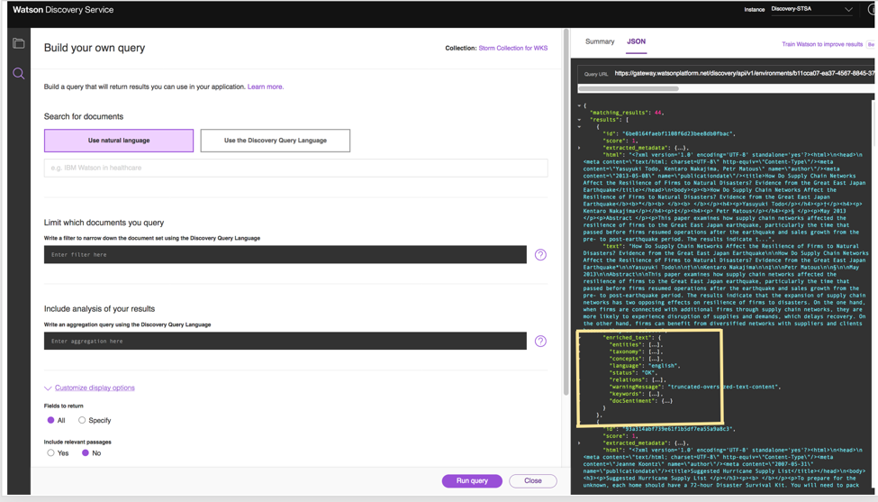

The specific portion that you need to see is the structure on the right side which is highlighted in the screenshot above. An expanded view of that section is shown in the screenshot below.


Expand each member of that enriched_text structure to study the way enrichment is returned in a JSON object. For your convenience additional screenshots are provided below that highlight the text.

**Entity** – the “text” field contains the actual entity. The rest of the parameters provide additional characterization on the entity


**Taxonomy** – Look at the label field, which is expressed in terms of a score.


**Concepts** – Look at the text portion for the concept along with the relevance score and the DBpedia resource identifiers.


**DocSentiments** – gives the overall sentiment of the document in the type field.

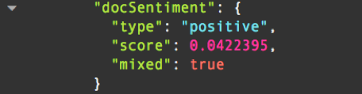

**Keywords** – look at the text field for the actual keyword, and the associated sentiments.


With the familiarity of the structure of the JSON object, here is how you can compose the query.

* Begin with enriched_text
* Followed by a period
* Followed by of the member objects of the enriched_text that you want to search for (entities, concepts, keywords, docSentiments, taxonomy)
* Followed by a period
* Followed by the field that contains the actual value for that object (like text, label, type etc)
* Followed by one of the operators mentioned in the table at (https://www.ibm.com/watson/developercloud/doc/discovery/query-reference.html#operators)
* Followed by the value you want to search

An example of this structure is shown in the following picture:

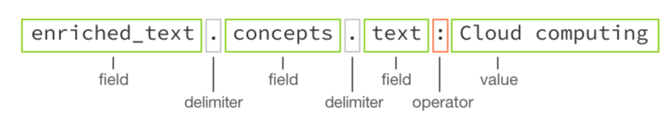

To test that out, open the query tooling, and click on the button “Use the discovery query language”. The screenshot is shown below.


Type the query enriched_text.concepts.text:storm and click the button “Run query” and see the results specific to storm on the right side.

Likewise you can try queries like the following:
```
* enriched_text.entities.text:hurricane
* enriched_text.taxonomy.label:supply chain
* enriched_text.keywords.text:fema
* enriched_text.docSentiment.type:positive (this kind of query will fetch all the documents that have overall positive undertone or sentiment. Try it…)
* enriched_text.keywords.text:hurricane,enriched_text.keywords.text:!storm (search for documents that contain the word hurricane but not storm, though there is no good reason why anyone would search for that combination)
```

If you have the time you are encouraged to try additional queries with different operators to familiarize yourself with the query structure.

In addition to that you can perform filtering using the structured queries. Filters help qualify the queries with additional constraints to get specific results. Try the following exercise to get a feel for how it works.

Open the discovery tooling and switch to “Use Discovery Query Language” option. Type the following query:

`enriched_text.concepts.text:cyclone`

Then suppress the passages, and change the number of results per page to 45, and click “Run Query”. Look at the result set and note down how many search results were returned. You may want to take a screenshot at this point so that you can compare this with the result set after applying the filtering. In our example, here is how the query performed, returning 18 results as highlighted in the following screenshot

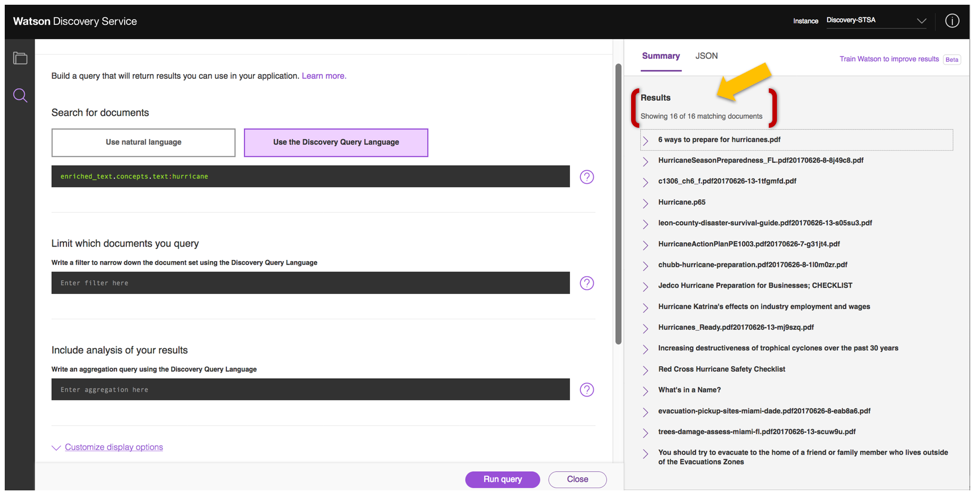

Now let us add some filters and see how the result set changes. Type for example, the following in the “Limit which documents you query” text field (as shown in the screenshot below) and click the “Run Query” button.

`enriched_text.concepts.text:!cyclone`

Compare the results now to see if there is any difference. You should see one or two documents filtered out in the search results because this filter requires the result to include only those documents that don’t contain the concept “cyclone”. In this example, the screenshot looks like the following, where you can see it filtered out 14 out of 16 results.


You can try additional complex filters to make sure you can filter things out by relevancy score, keywords, sentiments etc.

Another important thing you can do with discovery query language is aggregations. Aggregations help you perform analysis and quantify various aspects of the search results. For example, you can use aggregation to get a count of top keywords, maximum and minimum values of fields in the metadata or enriched data, even plot a histogram if your field involves a numeric value. For the set of aggregations supported, refer to the following documentation page:

https://www.ibm.com/watson/developercloud/doc/discovery/query-reference.html#aggregations

As an example, go back to the previous query that you just tried, remove the filter, and type the following query:

`enriched_text.concepts.text:cyclone.`

In the input field “Include Analysis of Your results”, type the following expression

term(enriched_text.keywords.text,count:15)

Click “Run Query”. This aggregation expression requires the discovery instance to publish the top 15 keywords. You can see the result as illustrated in the following screenshot. You can see the keywords listed on the right side, with the count in brackets adjacent to each one of them.


As another example, try the following aggregation expression with the same search query as in the above example:

 `term(enriched_text.entities.text).top_hits(5)`

That should give you the top 5 hits in the list of entities. A screenshot is attached below for illustration.


At this point you should have a good idea of how to use standard queries using Discovery Query Language and perform things like filtering, and aggregation.

## Task 8 - Explore Watson Discovery API
The objective of this step is to explore the power of Watson Discovery Service APIs. After completing this section, you will be able to perform the following:

1.	Exercise the APIs to create and alter the discovery service instance (including collections and documents)
2.	Exercise the APIs to issue queries
3.	Fine tune the results using training

Watson Discovery Service provides a rich set of APIs to work with the environments, configurations, collections, documents and issuing queries. In the previous section, you explored the same features using the discovery tooling. In this section we will do the same using the APIs.

As you know, Watson Discovery Service provides APIs in various languages like Python, Java, Node and command line option using Curl. The following URL shows all the REST APIs for the Discovery service.

https://www.ibm.com/watson/developercloud/discovery/api/v1/

In this exercise we will use the API Explorer tool to get comfortable with the APIs. You are encouraged to test the APIs using your language of choice on your own. The steps involved in using the APIs are as follows –

(1) Obtain the connection to your discovery service instance

(2) use one of the standard HTTP requests like GET, PUT, POST, DELETE with parameters appropriate for the given invocation

Open a browser and access the Watson API Explorer page  https://watson-api-explorer.mybluemix.net/. The screenshot of the page is shown below


Scroll down the page and click on the “Discovery” link to access the API explorer for Discovery service. The screenshot is shown below for illustration.


Upon clicking, you will be taken to the following page, where you can see APIs corresponding to various operations specific to Discovery.

https://watson-api-explorer.mybluemix.net/apis/discovery-v1


In the rest of the remaining exercise we will try a few APIs using this explorer tool. To invoke the APIs, you need the credentials configured with your discovery instance. The steps to get the service credentials (username and password) is outlined [here](https://github.com/ibm-cloud-architecture/refarch-cognitive-discovery-broker#test-locally).

First get your credentials, and input them in the username and password fields at the top right of the page as indicated by a yellow rectangle in the following screenshot. [There is no button like submit or any thing. Just make sure those two fields filled in throughout this exercise. The values are not erased after each API invocation, so you shouldn’t have to fill-in those values each time]


The credentials you just configured acts as the credential for all the API invocation.

To start with a simple one, let us list the available environments. On the API page (same page shown above) go to the “Environments” section, and click on “List environments” (on the right most column as highlighted in the following picture).

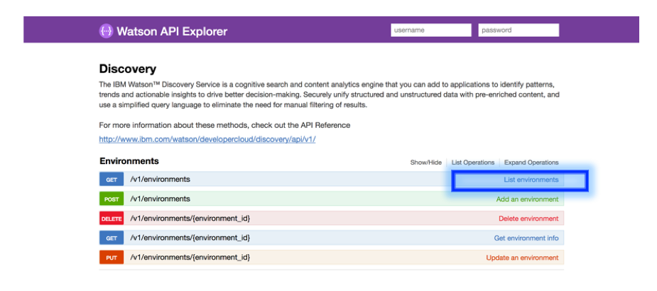

The resulting screen with the API details should appear like the following. The details are self explanatory.


The first few sections starting from “Implementation Notes” outline the signature and the response structure of the API. The text field “Example Value” shows the example output value for a fictitious “Test environment”. The actual value for this may be different for your case. If you want to see the schema of the output, you can click on the “Model” (greyed option left of the title “Example Value”). That will refresh the text field with the structure of the response. As for the “Parameters” section, don’t change the value for “version” shown in the screen (should be 20176-25-06). In the “name” field you can input any value you want, though, for this exercise, you can leave it empty and press the button “Try it out”. This will show you the response like the following. A “Response code” of 200 indicates successful invocation, and with the response filled in the text box “Response Body”.
Look at the Curl command, which you can execute from the command prompt if you want (those of you not familiar with Curl, no need to try it because we are testing the APIs using an alternative mechanism, which is this explorer tool).

Look at the request URL and familiarize yourself as to how the parameters are passed.

Inspect the content of the text box with label “Response Body” to study the output of the API invocation. Depending on the results in your case, you may see a scroll bar on the right edge of the text box – you may need to scroll down to see all the response content.


That was a simple API call for you to get a feel for how this works. When you invoke this using Java or Python or Node, the same concept applies, with the only difference being the language specific bindings and constructs.

Now go ahead and collapse this API by clicking on the “List Environments” for this API, and click on “Update an environment”. As for the input values –

* environment_id: Copy the environment_id for the collection you created earlier. The steps to find the environment_id is outlined in one of the earlier sections
* body: Click on the text box with label “Example Value” (on the right side of the “body” input text field). This will copy the skeleton payload in the “body” input text field. Change the values for “name” and “description” to whatever values you like.

With all the input fields filled in, the screen should look like the following. Click on “Try it out” button.


The response should look similar to the following. Scroll down the response body and study the response values.

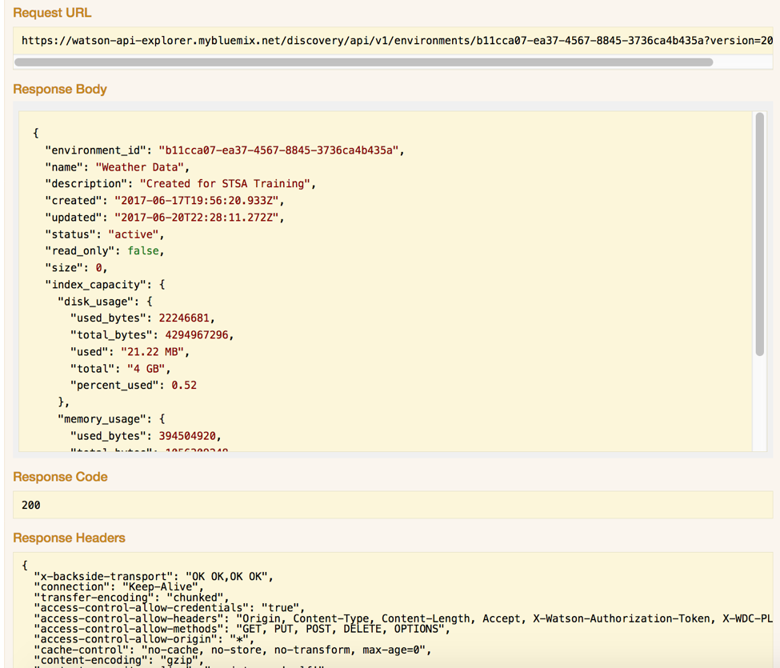

The above invocation set the name and description, but you can verify that by issuing another API “Get environment info”.

Click on “Get environment info” and fill the input field “environment_id” with the same value you used above. Click on “Try it out” and inspect the response body. Now you should see the values you set for “name” and “description” fields using the previous API (update an environment).

The sequence of the APIs above illustrates the structure and the invocation mechanism behind the discovery service APIs.

As a next API, let us try to test a sample document sending it through the conversion, enrichment, and normalization steps. Expand the API “Test configuration”. By now the parameters should be self explanatory to you. Accept the default for “version”, and fill in the values for “environment_id” and “configuration_id” from your specific collection. For the parameter “step”, pick one of the values from the drop down box (this example tests conversion by performing PDF to html_output). Click the “browse” button and choose the file “checklist_2014.pdf” from the dataset provided to you. You are welcome to choose any other file to experiment with this step. Leave the “metadata” field empty, and your parameters should look like the following before invocation.

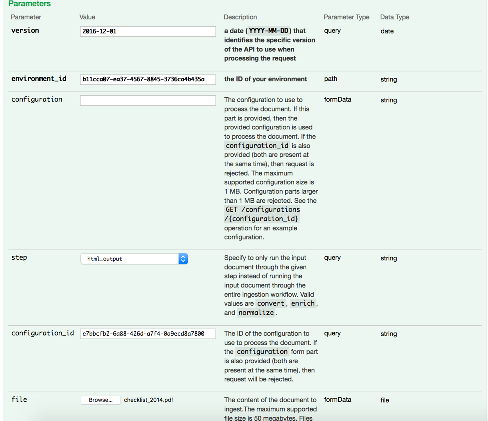

Now click “Try it out” button. The result should look like the following.


As a check point questin, test the configuration for the file “CDC_Plan_Hurricanes.pdf” and find the relevance score for the concept “wind shear”.

As a next exercise, let us try working with collections. Collections are the most important, and fundamental artifacts you need in order to be able to make queries and use the features of discovery service.

Click on “List collections”. Provide the right value of the input field “environment_id” and click “Try it out”. To make sure this works correctly, you may want to go back to the tooling and create one or more collections, and try this API again. In the response section you should see all the collections.

The request part of the API should look like the following:

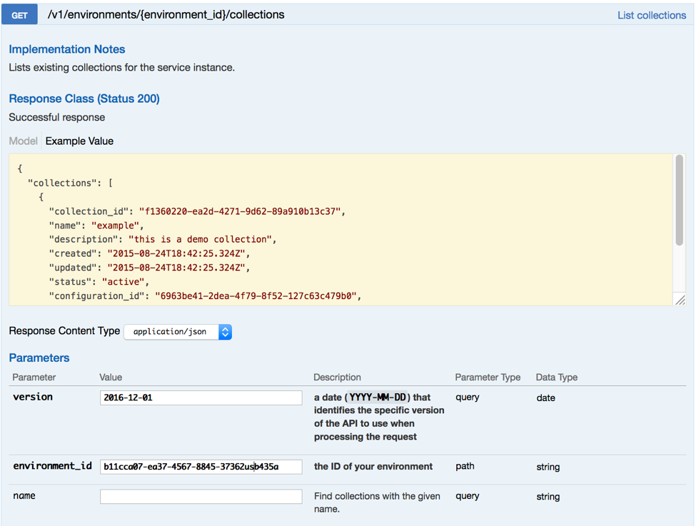

The response should look somewhat like the following:


As you can see, I have two collections namely “HurricaneInfoCollection” and “InitialTestCollection”. Your results may vary depending on how many collections you created prior to invoking this API.

Now let us create a new collection using API and verify it was created. You can verify it using the tooling as well as using the API invocation like we did above with ‘List Collections”.

Go ahead and expand the API “Create a collection” and configure the request with input parameters like environment_id etc. Click on the text box with label “Example Value” (right next to “body” input field). That will copy the skeleton body into the input text field. Pick a name for your collection and description (feel free to leave the configuration_id) and click on “Try it out”. The following screenshot shows the request for creating a collection “AnimalKingdomCollection”.

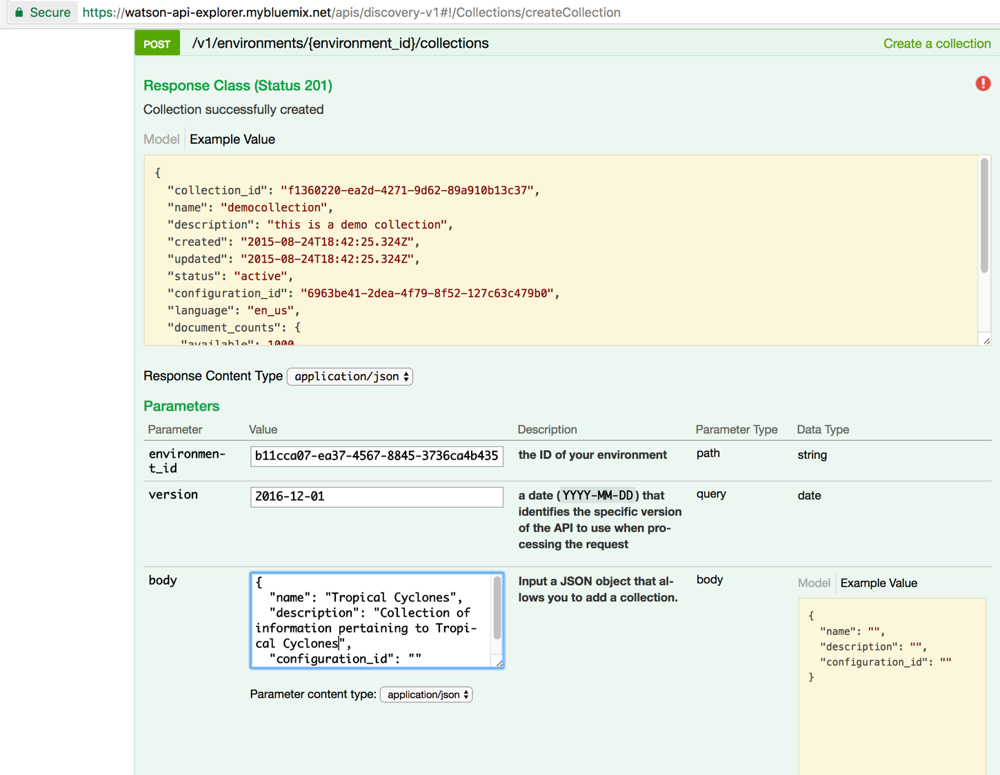

The response should look like the following:

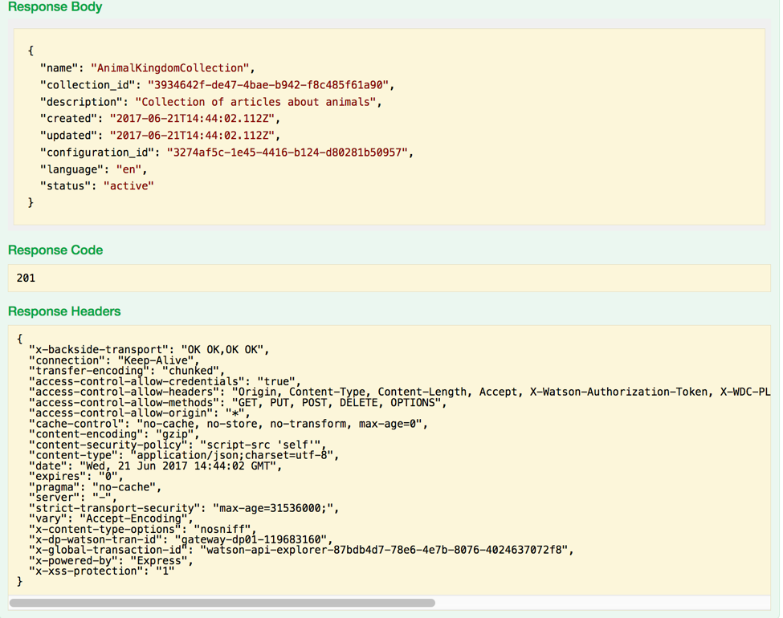

Now go back to the tooling and verify this collection shows up in the list of collections.  Launch the discovery tooling from the UI using “Launch tool” button –


In the resulting screen you should be able to see the newly created collection.

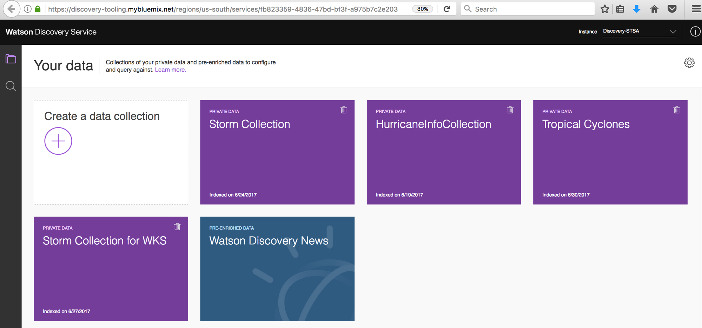

Now invoke the “List collections” API again and verify this newly collection creation shows up in the response section.

Now try the API to delete the newly created collection. You need the collection_id for the newly created collection in addition to the environment_id. You can get the collection_id in one of the two ways. At this point of the tutorial you should be able to do both the following with ease, but for your reference the steps to find the collection_id are outlined along with the screenshots.

* Go back to the tooling as shown above and click on the Collection. You should be able to see the collection_id. The screenshot is shown below, and the collection_id is highlighted for your reference.

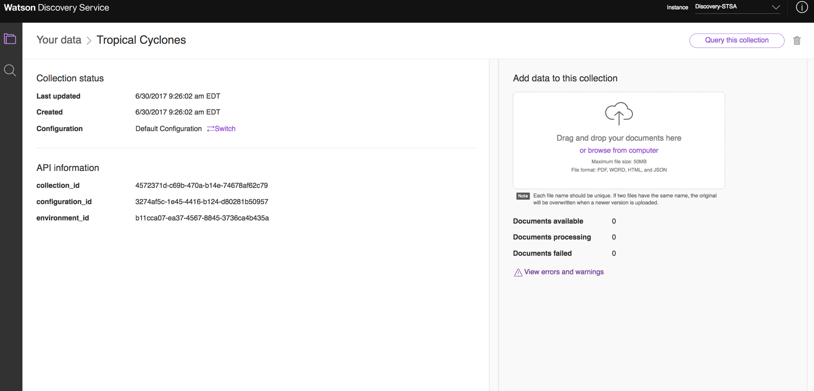

* Invoke the API “List collections” and retrieve the collection_id. The response is shown in the following screenshot along with the collection_id.

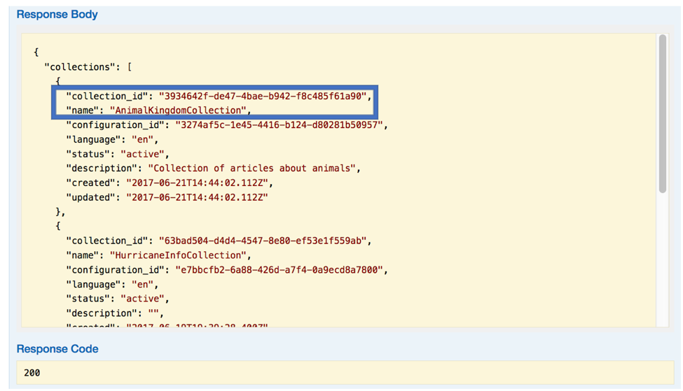

Once you get the collection_id using one of the methods outlined above, use that to invoke the API “Delete a collection”. Now go to the tooling and make sure the collection is deleted, and optionally you can try the “List collections” API again to verify the newly created collection no longer shows in the response.

At this point you should be able to try additional APIs without the help of screenshots. You should also be able to retrieve things like environment_id, collection_id etc. From this point onwards the remaining instructions will assume you can create a collection, retrieve the metadata about the collection.

### Add documents using API
Now let us try adding a new document through the APIs. Create a new collection for this purpose, or you can work with one of your existing collections. The following example uses a newly created collection called “StormCollection”. It is easier if you stick with the same subject (like hurricane, storm, cyclones, weather etc.) because you can use one of the existing documents provided with this tutorial.

Let us use the API to add the document “FloodSmart_FEMA.pdf” which is included in the data set. Expand the API “Add a document” and fill in the input parameters. You can leave the configuration, metadata etc. empty. Choose the file “FloodSmart_FEMA.pdf” using the “Browse…” button. The input parameters should be configured as shown in the following screenshot (with the exception of environment_id and collection_id which will be unique to your own environment and collection)

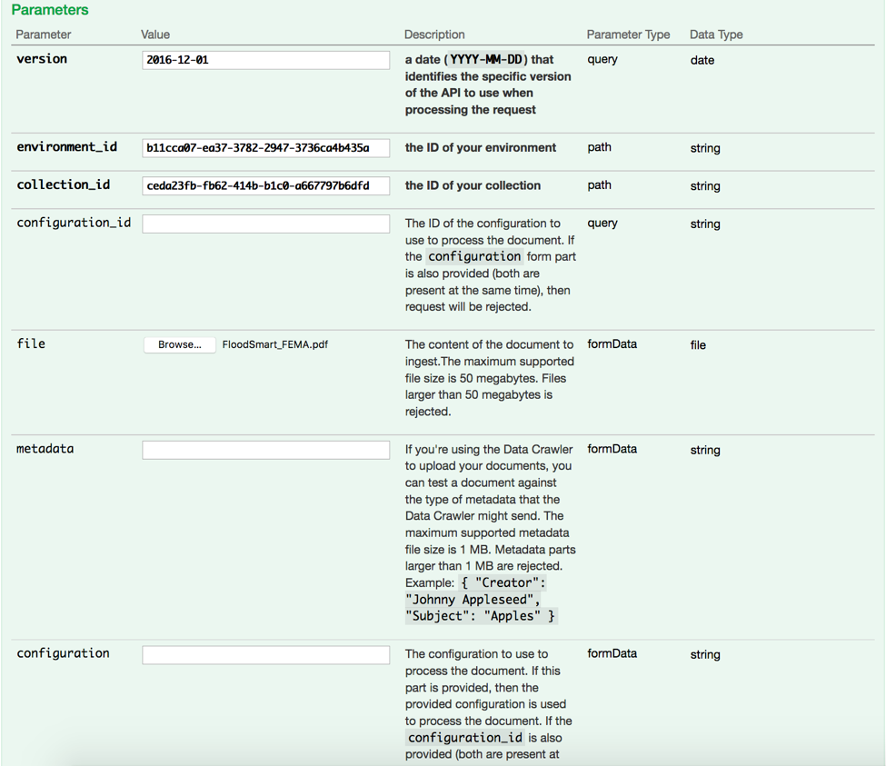

Click on “Try it out” and look at the response. The response may involve the status set to “processing”. That’s okay because the API returns immediately while the document is being processed and included in the collection. The sample response is shown in the screenshot below, with the “status” field of the JSON response highlighted using a rectangle.


Go back to the tooling, and open the collection (in this example, StormCollection, but you may have chosen a different name) and verify it shows a document has been added. A screenshot is shown below highlighting the document count.


You can issue a simple query related to this document and make sure it works. Ofcourse there is only one document in the collection, so the number of queries you can issue will be limited to the content addressed in the “FloodSmart_FEMA.pdf” file.

As the last step, let us see how to issue queries using the APIs. Expand the “Query documents” API and fill in the input fields. In addition to the usual mandatory ones like environment_id and collection_id, you also need to provide value for either the “query” field (in structured format) or “natural_language_query” (in natural language) to test this part. Optionally you can also provide values for “filter”, “passages” etc. Assuming you used the FloodSmart_FEMA.pdf file to add the document, type the text “Do I need flood insurance?” in the “natural_language_query” input field. Click the button “Try it out”, and you should see a response like the following.


Inspect the Response Body to check the results.

Checkpoint question - use the APIs to load the file Hurricane_noaa.pdf, and run the query “What is Saffir-Simpson scale?”. In the result, find the concept “Beaufort scale” and describe the relevance and other details reported in the response.

At this point, you should feel comfortable with how the APIs work, and how to use them. You are encouraged to try the queries in your language of choice (Python, Java, Node). If you need help please contact the instructors. Installing jupyter notebook locally will help test Python code snippets. The following github page shows the collection of all APIs / SDKs and code snippets.

https://github.com/watson-developer-cloud/cm_mc_uid=90789784077014965835593&cm_mc_sid_50200000=1498163451&cm_mc_sid_52640000=1498163451

# Level 3 - Advanced Topics - Developer centric
## Task 9 - Training Discovery
As a next step, this section outlines the steps to train discovery service to return meaningful results. It is important to improve the relevancy of the queries the users issue, at least for the most frequently searched and important queries.

There are two ways to accomplish this task. Both options involve a collaboration between the developer, and an SME / domain expert.

1)	Using the training query sets with sample results and relevancy scores. Watson Discovery uses *machine learning* to train the service using this sample query set. There are two ways to do this
	* Composing sample training queries as JSON payload, and posting them to the discovery service using either command line tool (like CURL) or using programming languages like Python / Java or Node. This option is relatively more powerful than the following because you can get very flexible with things like filters, cross reference etc. But this requires manually preparing the queries, or building a special application to do things programmatically. If you are interested in this option, please check the [product discovery documentation]( https://www.ibm.com/watson/developercloud/doc/discovery/train.html)

	* A beta version of training tool that comes with the discovery instance. https://www.ibm.com/watson/developercloud/doc/discovery/train-tooling.html

2) Using Watson Knowledge Studio (WKS). This is a powerful way to teach Watson domain specific constructs such as key words, but note that WKS is a separate offering and not included with Watson Discovery.

Let us explore the option 1-b in this lab, which is building the sample training queries using the tooling option. This uses a UI based ranking process, as opposed to manually building the JSON payloads and queries. Keep in mind that this is still in a beta stage, and the functionality is limited at the moment.

To understand the importance of using training and fine tuning the relevancy, let us do some quick testing by creating a collection, and issuing a few queries to see what kind of results are presented.

Open the discovery tooling, and create a new collection (you can do this using the tooling as opposed to API because it is faster). Name the collection whatever you want, but in this example, we call it “storm collection”. Load all the documents provided to you in the dataset under the folder “Basic Collections”. This collection includes a whole bunch of PDF files, some prepared well and some others not. Some of these files are relevant to the queries we will be testing, and some other files are not relevant. Load all of them and wait until they are fully ingested by the service. If you forgot the steps, go to the beginning of this tutorial for stepwise instruction on how to create a new collection and load the documents, or you can watch the following video [collection-creation-for-training]

First issue a simple query “how do I prepare for hurricane” on your collection, and make sure it returns some results. Adjust the number of results to some number like 50, so that you can see all the results. For clarity and ease of reading, you may want to turn off the “include relevant passages” radio button (shown in the following screenshot using the green highlight on the lower left corner)


As you may have guessed, this simple query is broad enough to get a large result set. If you look at the yellow highlight in the picture above, you can see the result includes all the documents in the collection (this example collection includes 43 documents, and the result includes all the 43). The reason is, all the files have the keywords “hurricane” and / or “prepare”. But not all the files contain relevant information. In the screenshot shown above, the files highlighted in orange rectangles are invalid results for the given query. Therefore it is important that we fine tune the result set, and teach the discovery instance to filter out invalid results. This process is called training, and we are going to do that using the beta version of the tooling.

In a real life scenario this training consists of two key steps:

1)	Coming up with sample training queries that are representative of what the users search. There are several ways to accomplish this. One is to search for the query logs to find the frequently searched queries. Alternatively one can harvest queries from a system deployed on a pilot basis or in a test environment. The key point here is, the sample training queries should be a good representation of the queries that the end users will issue.
2)	Use the discovery service tooling to train the service by ranking each response to the query as relevant or irrelevant. The discovery service uses this ranking to train itself using machine learning algorithms. Note that in the API approach you have some flexibility to configure the relevancy scores using numerical values on a scale of 0 to 100. But in the beta version of the tooling as it stands today, you are limited to two values - relevant or irrelevant.

Now using the tooling, let us train the instance for this basic query to filter out the results that are highlighted in orange color in the screenshot above.

Click on the link “Train Watson to Improve the Results (Beta)” on the top right corner. In the screenshot attached above, this menu is highlighted using blue color at the top right corner. That should take you to the page as shown below:

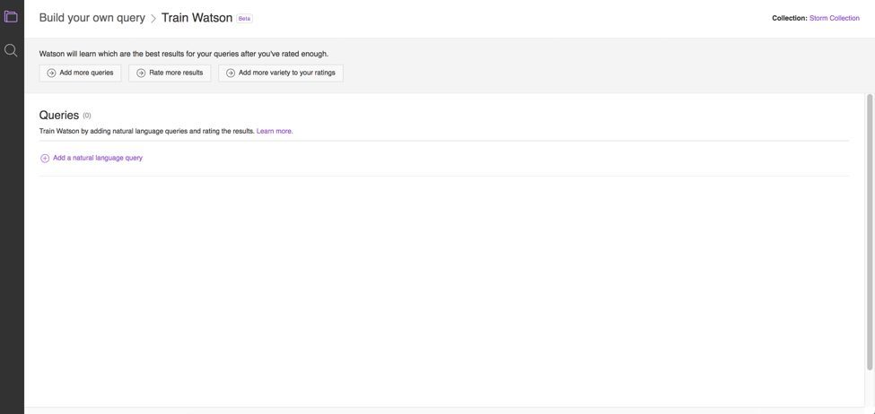

Click on the link “Add a natural language query”, which should show you the option to add a new sample training query. Type the query “How can I prepare for hurricane?” in the query text field as shown in the following screenshot, and then click on the “Add button”.

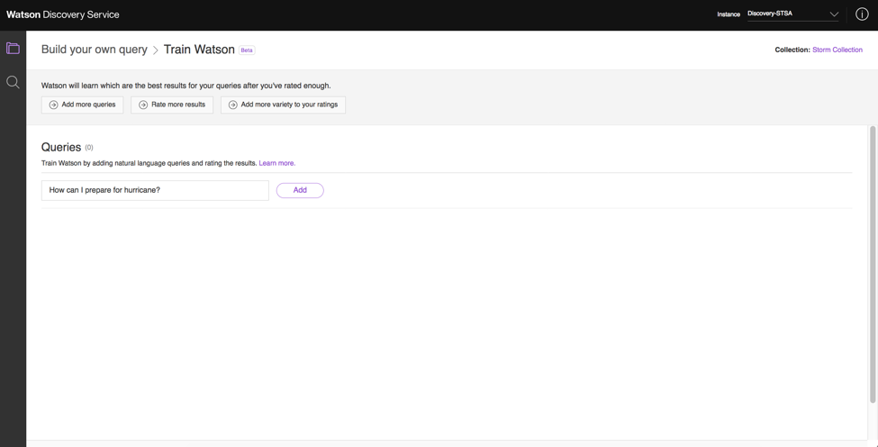

Upon clicking the “Add” button the system will add this as a sample training query, and give you the option to rate the responses. At this point your screen should look like the one shown in the following screenshot.

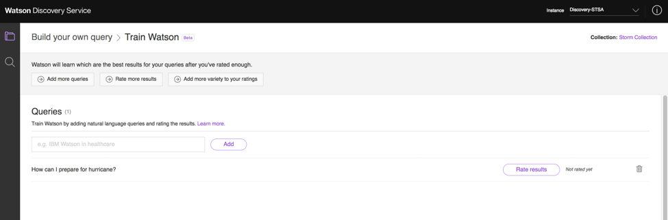

Note that you don’t need to do a prior search using this query in order to train Watson. You can directly come to this training tool and start the training using sample queries. In this lab we did a prior search just to show how irrelevant results show up when the system is untrained, and the corpus contains wide ranging information involving the search key words.

Now click on the “Rate results”. This action will take to a different screen where you can see the search results for this query that you can rank on an individual basis as either relevant or irrelevant. The screenshot is shown below.


Start ranking the individual results as relevant or “Not relevant”. For this lab, we will be marking the following 9 results as “Not relevant”. The rest of them should be marked relevant. Keep going through the list and mark the following as “Not relevant” and finish the whole search result set. To move along the search results click on the right arrow “>” mark on the bottom of the page as highlighted in the screenshot above.

1)	Microsoft Word - article - Supply Chain - Economic Consequences of Disruptions- w Tom Schmidt, Kathy Stecke, et al.docx
2)	Simulating Effects of Transportation Disruption on Supply Chain Based on Vendor Managed Inventory Approach
3)	Climate Change An Information Statement of the American Meteorological Society
4)	Managing Supply Chain Health
5)	c1306_ch6_f.pdf20170624-8-jjxed6.pdf
6)	What's in a Name?
7)	How Do Supply Chain Networks Affect the Resilience of Firms to Natural Disasters? Evidence from the Great East Japan Earthquake
8)	Increasing destructiveness of tropical cyclones over the past 30 years
9)	Hurricane Katrina's effects on industry employment and wages

After rating the documents using the above guidelines, you should be on the last page of the search results as shown in the following screenshot

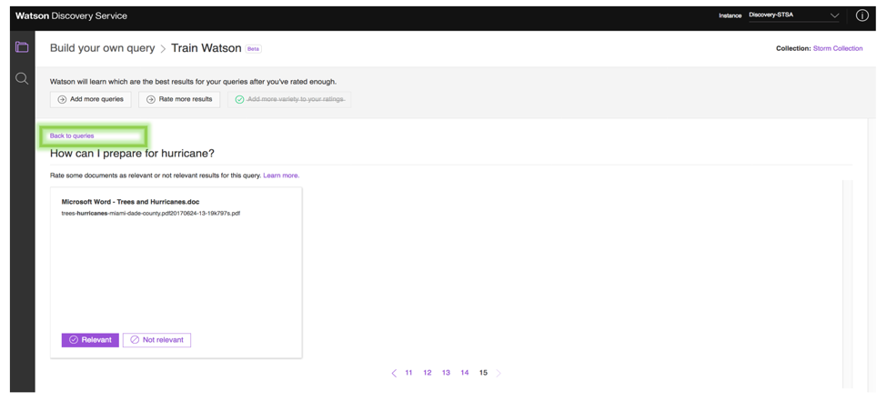

Click on “Back to queries” link highlighted in green in the screenshot above.

This should bring you back to the main page as shown below. If you followed the steps exactly, you should see 34 documents rated as “relevant” and 9 documents rated as “not relevant” as shown in the following screenshot using the green rectangle.

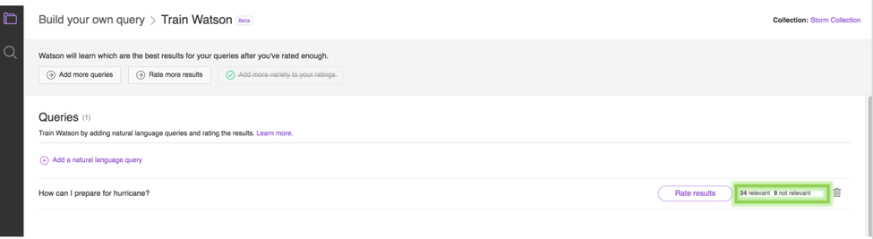

A tip – for some results, you may not be able to clearly decide between relevant and not relevant. The result may apply to a certain extent so you may find it somewhat relevant. In this case, pick neither option – relevant or not relevant, and move on to rating other results. Mark only those results you can clearly indicate as either relevant or not relevant.

At this point you just trained Watson discovery service with 1 sample training query. Watson discovery service keeps learning as you submit more training queries, and indicates when it has enough samples to complete the training. The indication is provided by means of green tick marks on the three buttons as highlighted using brown rectangle in the screenshot above. In this particular case, the system indicates there is enough variety in the ratings (note the green tick mark on the third button from the left). But the other two buttons without a green tick mark indicate that you need to add more queries and rate more results for Watson to understand the accepted result patterns. In a real life scenario, you will add lot more training queries and rate the responses. But for this lab we will stop with this example due to paucity of time. But if you have the time, you can try more training queries until you see tick marks on the other two buttons. Some sample queries are listed below for your experiment. Attached below is an example of the screenshot with more training queries added and rated. You may notice the green tick mark on the “Rate more results” as highlighted. Based on the product documentation, it takes minimum of 49 queries for the training process to work well, and in our example, we have to add more sample training queries than what we have in order to start seeing meaningful results.

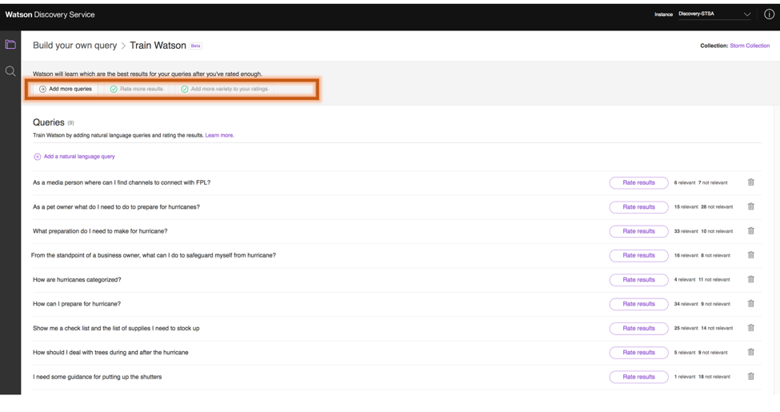

Once you are done with that, it will take about 30 minutes for the system to complete the training and reflect in the results. Roughly 30 minutes after you performed this training, you could go back to the query page and try a similar query. The sampling query isn’t meant to cause “over fitting” in the system, so try queries that are similar to, but not necessarily identical to the sample query that you just used to train the system.

Also note that this training doesn’t necessarily have to be a one time task. In a real life use case this could be a continuous process. As more documents are ingested, and as you identify more queries, you would come periodically train the system to fine tune the results in order to improve the accuracy.

Here are some sample queries that you can try if you have the time. Keep in mind that we have very few documents in the collection for this lab, so you may not find enough results to separate as relevant versus not relevant. Some of the following queries may have only one relevant response in the system, making it less meaningful to train. For those cases, you can avoid using them as sample queries. Feel free to take a “scenic tour” by adding more documents to the collection, and coming up with your own sample training queries. The list of sample queries are as follows:
```
*	How do I prepare for hurricane as a home owner?
*	What should I do to prepare for hurricane as a resident of the leon county?
*	How should I prepare for hurricanes as a business owner?
*	How can I prepare for the hurricane as a person with disabilities?
*	How should I prepare for the hurricane with an elderly person, senior citizen in the household?
*	As a pet owner, what additional preparations I need for the hurricane?
*	From the standpoint of a business owner, what can I do to safeguard myself from hurricane?
*	I need some guidance for putting up the shutters
*	What do I need to do given I am a resident of Miami dade county?
*	I decided to stay home, and not evacuate. What are the must have things for me?
*	If I go to a shelter, what should I bring?
*	Show me a check list and the list of supplies I need to buy (or stock up)
*	How should I deal with trees during and after the hurricane?
*	As an emergency worker, what is the process for me to deal with downed power lines?
*	What are some of the deadliest hurricanes?
*	Tell me about the science of hurricanes?
*	What is Saffir-Simpson scale?
*	What are different categories of hurricane?
*	What do categories mean in the context of hurricanes?
*	I am a media person, and where can I find channels to connect with FPL?
*	What is the social media handle for Florida’s power & electricity department?
*	As a resident of Florida, I want to know how long will it take to restore the power after the hurricane
*	How are hurricanes named?
```


## Task 10 - Broker code explanation
The Watson Discovery Service can be integrated in a Web application or wrapped as a micro service deployable on Kubernetes cluster. As developer you will use the Watson developer API which is offered as different programming language.

The current broker code is defining a server layer to support simple RESTful api, mostly used by a front end. The code explanation is in [this note](../broker-code.md)

For information about containerizing the broker see [note](../wds-broker-kube.md)

### Link between Conversation and Discovery
To support long tail interaction, Watson Discovery in conjunction with Conversation is used to support end user's query which could not be completed with pre-defined dialog flow. So the broker code is propagating the query or transform it so it can be processed by WDS and the results are returned. As the path is initiated from a Watson conversation, the core of the integration with both service is done in the Conversation Broker which can be found in this repository: https://github.com/ibm-cloud-architecture/refarch-cognitive-conversation-broker and the long tail query is defined in a dialog node as part of the context variable and managed by the Conversation Broker as explained in the note: [Delegate to Watson Discovery](https://github.com/ibm-cloud-architecture/refarch-cognitive-conversation-broker//tree/master/doc/wds-itg.md)

## Task 11 - Enhance with Watson Studio
You can enhance the discovery service capabilities by applying a custom model built using Watson Knowledge Studio (WKS). This helps improve the discovery service's in-built enrichments. A potential usecase for this is bringing information specific to a given domain so that discovery can perform more custom document enrichments appropriate to the discipline.

The following screenshots show a simple illustration of WKS annotations specific to our storm related collection.


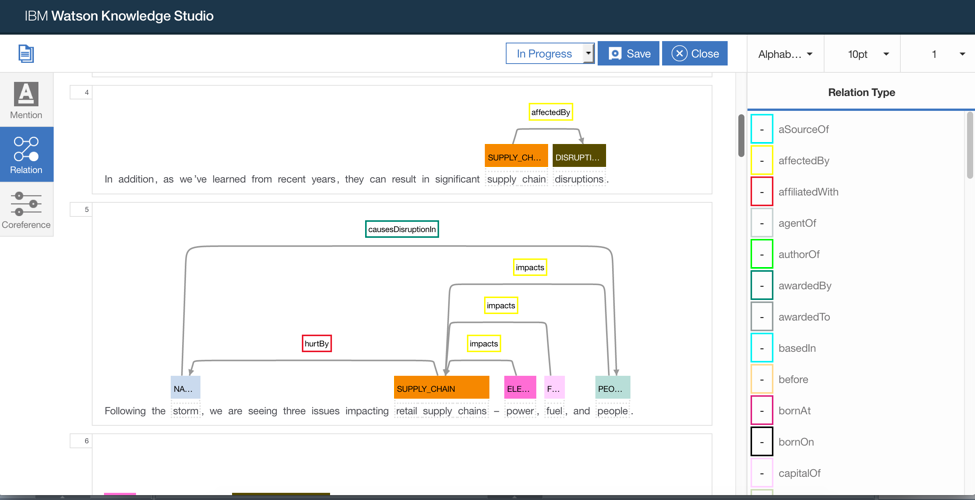

In order to be able to integrate a WKS model, you need WKS subscription (paid or free one), and document sets to create annotations or rules in WKS. A full hands-on tutorial of WKS is beyond the scope of this lab, so we assume you already know how to build the type systems, relations, models using WKS, and create a snapshot of the model.

To perform this exercise, you can try taking the .txt files provided in the subfolder "/WKS/ML Training" and import them into your document set. Starting with defining the type systems, go through the WKS workflow, create annotation sets, tasks, and perform the annotations. Alternatively you can choose to build a rules based model insetad of ML model. Look at the model details and statistics, and if you are satisfied, take a snapshot. Once you have the snapshot ready, integrating this with Discovery is a two step process. The first step is model deployment, and the second step is model association with the specific collection.

To perform the first step, open the model in WKS, and click on "Deploy" against the version of the model you want to deploy into the discovery instance. That should bring you a screen like the one shown in the following screenshot:


Select "Discovery" and click "Next". In the resulting page pick the Region, Space, and Service Instance where you want your WKS model deployed. The following screenshot illustrates this step.


Click on "Deploy" and finish the deployment process. Note down the model id that is displayed. This is your WKS model Id. A screenshot is attached below to show this screen and the model id. Now you have deployed your WKS model to a discovery instance.


The next step is you need to associate this model to one or more collections in your discovery instance. This has to be done using CURL command. This process involves downloading your collection configuration as a JSON file, updating the JSON file with WKS model Id, and then sending it back to your collection over a PUT request, to update the configuration. This also implies that you should have a custom configuration associated with your collection to begin with. The reason is you cannot update the default configuration. If the collection that you want to use with WKS uses the default configuration, now is the time for you to switch it to a custom configuration. Once you are sure your collection uses a custom configuration, note down the configuration id, environment id and collection id. In addition you will also need the credentials (user id and password) for your discovery instance.

First issue the following command using command prompt (replace the userid, password, etc with appropriate values)

curl -u "{userid}":"{password}" "https://gateway.watsonplatform.net/discovery/api/v1/environments/{environment_id}/configurations/{configuration_id}?version=2017-06-25" > current_config.json

Open the current_config.json file (or whatever name you used for the file), and save it as a copy. Call it "wks-updated-config.json". You can either do this using a text editor, or use one of the JSON editing tools. Perform the following updates to the wks-updated-config.json file

* Change the description (optional)
* Go to the "enrichments" section of the file, and add any additional items under the options/extract field.
* In the options section, add a new field "model" as shown in the following example, and assign the value of your WKS model id that you got after deploying the WKS model in the previous step [caution - if you are adding the model field at the end, don't forget to add a comma after the previous line "quotations":true]

Once you are done your "enrichments" section should look somewhat like the following.

"enrichments": [
  {
    "destination_field": "enriched_text",
    "source_field": "text",
    "enrichment": "alchemy_language",
    "options": {
      "extract": "keyword, entity, doc-sentiment, taxonomy, concept, relation",type
      "sentiment": true,
      "quotations": true,
      "model": "{your WKS model id}"
    }
  }
]

Save the wks-updated-config.json file (or whatever name you used for the file).

Issue the following command to send this configuration to discovery using a PUT command. Keep in mind that in this example, we are using the file name "wks-updated-config.json". If you used a different name, make sure the command reflects the right file name. Replace the values appropriately and execute the command.

curl -X PUT -u "{userid}":"{password}" -H "Content-Type: application/json" -d @wks-updated-config.json "https://gateway.watsonplatform.net/discovery/api/v1/environments/{environment_id}/configurations/{configuration_id}?version=2017-06-25"

If the result is updated json, then your command is successfully executed.

This completes the second step of associating your WKS model with a specific collection. You can go back to your collection or the application that uses the collection, and issue queries as before. If your model was built using right set of document sets, and well annotated, then it should reflect in thes search results. In this lab example, we are using less than 50 documents in the collection, and a few others to build the WKS annotation. Hence this is not the realistic scenario for you to expect remarkable differences in the outcome. If time permits, you are encouraged to add more documents into your collection, and build meaningful annotations involving larger document sets.  

# References
* [Discovery main page](https://www.ibm.com/watson/developercloud/discovery.html)
* Discovery [API](https://www.ibm.com/watson/developercloud/discovery/api/v1/#introduction)
* https://www.ibm.com/watson/developercloud/doc/discovery/train-tooling.html
* Some SDK https://github.com/watson-developer-cloud/cm_mc_uid=90789784077014965835593&cm_mc_sid_50200000=1498163451&cm_mc_sid_52640000=1498163451
* Query reference: https://www.ibm.com/watson/developercloud/doc/discovery/query-reference.html
* Mix of Image Recognition and Discovery  http://watson.ted.com/
